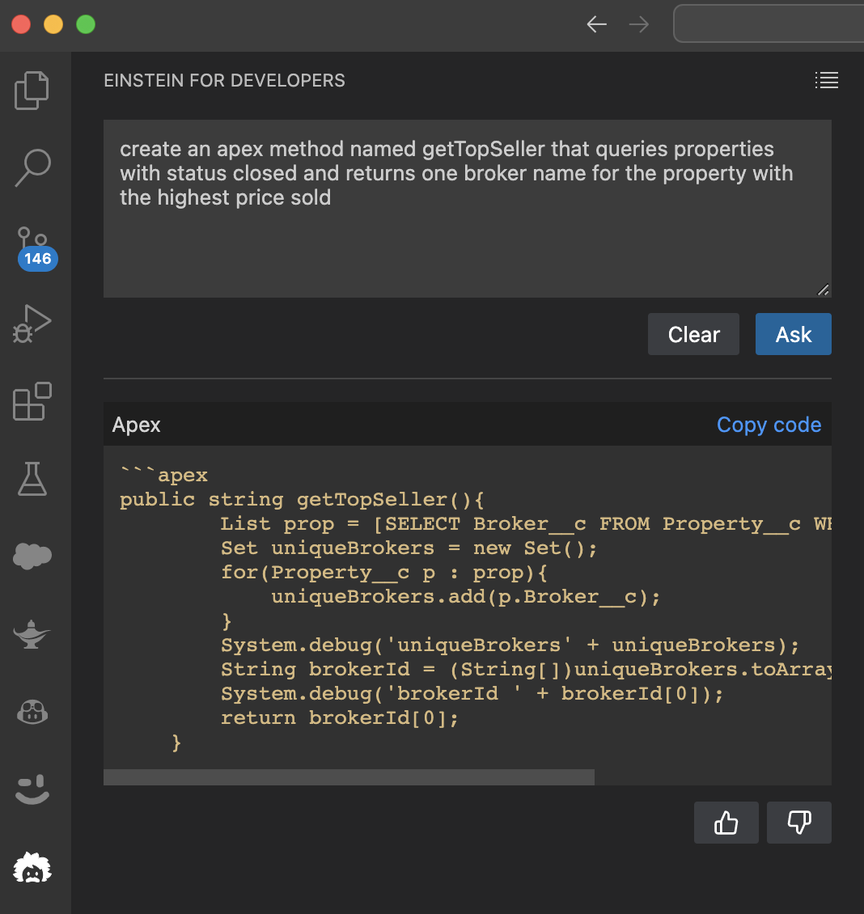

## Generate Apex Code

Use the Einstein for Developers side bar to write a question or an instruction that describes the task for which you'd like to receive an Apex code suggestion and press **Ask**. Copy the code suggestion you received and paste it into an Apex file to use as "starter" code.

## Use the Command Palette to Generate Apex Code

You can quickly access Einstein for Developers from inside an Apex file in the VS Code editor.

1. Open an existing Apex (`.cls`) file, or create one from the command palette by running the **SFDX: Create Apex Class** command. You can also use the Org Browser to retrieve an Apex class from your org.
2. Put your cursor on the line in the file where you want the generated code to be placed.
3. From the Command Palette, run **Einstein: Generate Code**.
4. For your query, enter text that describes the code that you want to generate. For example, “_Write a method that takes an account as a parameter and returns all contacts associated with that account_.”
5. Review the code that Einstein generates, and then click **Accept**, **Try Again**, or **Clear**. 

Use our example prompts to exercise your code generation muscle and learn how to get the most out of the generative AI tool.

**Note**: You can also access the **Einstein: Generate Code** command through hotkeys. Keyboard shortcuts are the following across environments:

- macOS - **Cmd+R**
- Windows & Linux - **Ctrl+R**

You may also customize these shortcuts. See [Keyboard Shortcuts editor](https://code.visualstudio.com/docs/getstarted/keybindings#_keyboard-shortcuts-editor) for more info.
